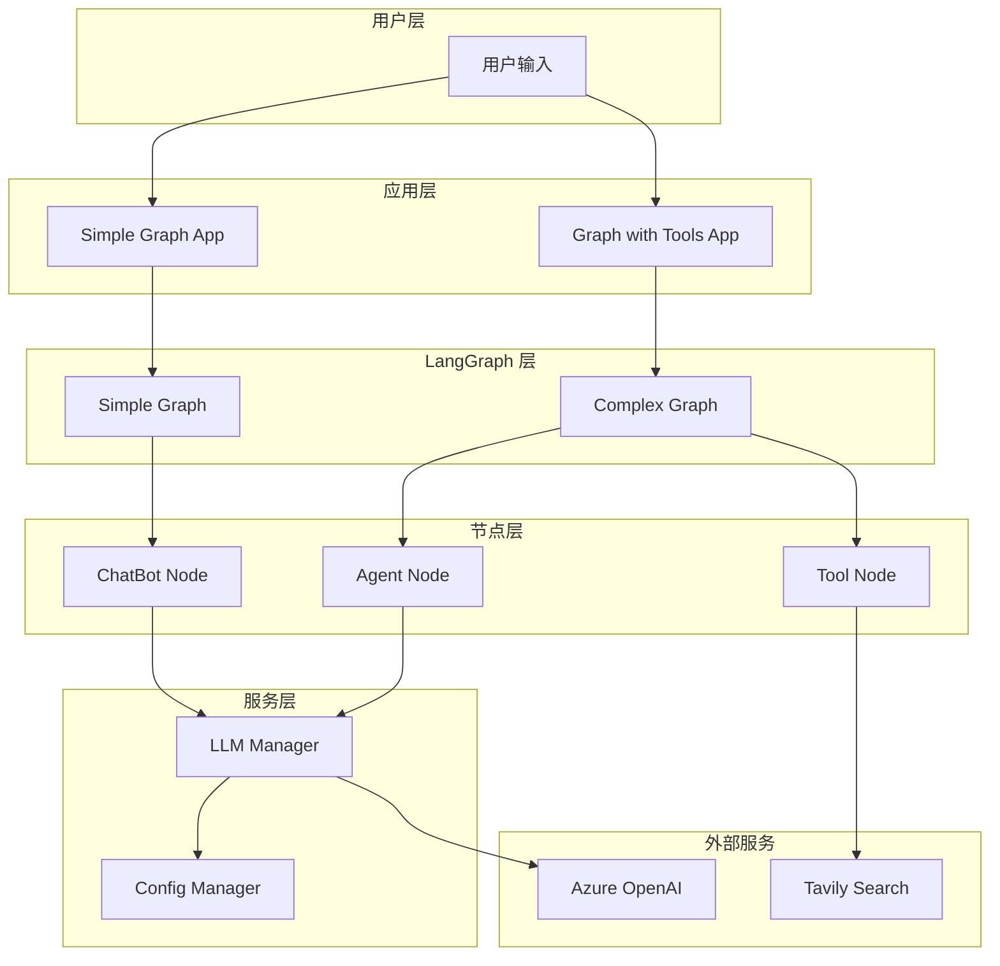
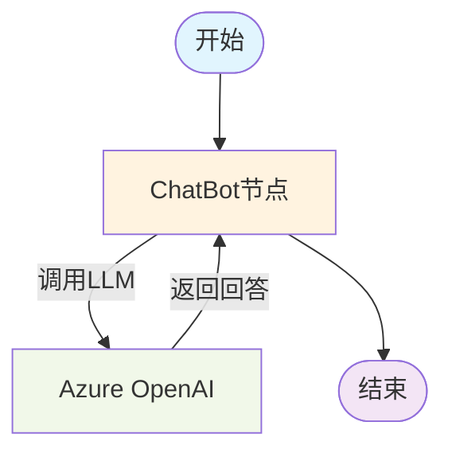
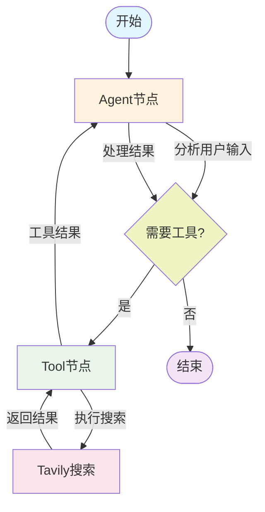

# LangGraph Demo 项目

> 基于 LangGraph 的多场景 AI 应用演示项目，展示从简单聊天机器人到复杂工具调用的完整实现

## 🚀 项目概述

这是一个完整的 LangGraph 学习和实践项目，包含两个核心示例：

- **Simple Graph** - 简单的聊天机器人，演示基础 LangGraph 使用
- **Graph with Tools** - 带工具调用的智能代理，演示高级 LangGraph 功能

项目采用模块化设计，统一配置管理，支持 Azure OpenAI 和自动降级机制。

## 📁 项目结构

```
langgraph-demo/
├── README.md                    # 项目说明文档
├── requirement.txt              # 项目依赖
├── .gitignore                   # Git忽略文件
├── simple_graph/                # 简单聊天机器人模块
│   ├── app.py                   # 主应用程序
│   ├── chatbot.py               # 聊天机器人节点
│   ├── state.py                 # 状态定义
│   ├── graph_visualization.mmd  # 图结构可视化
│   └── README.md                # 模块说明
├── graph_with_tools/            # 工具调用代理模块
│   ├── graph.py                 # 图构建和执行逻辑
│   ├── state.py                 # 状态定义
│   ├── tavily_tool.py           # Tavily 搜索工具
│   └── README.md                # 模块说明
└── utils/                       # 通用工具模块
    ├── __init__.py
    ├── config.py                # 配置管理
    └── llm_manager.py           # LLM管理器
```

## 🏗️ 架构设计

### 系统架构图



### 核心组件

#### 1. 配置管理系统
- **统一配置**: 通过 `utils/config.py` 管理所有环境变量
- **类型安全**: 使用 TypedDict 确保配置类型安全
- **自动验证**: 启动时自动检查配置有效性

#### 2. LLM管理器
- **单例模式**: 全局唯一的 LLM 实例
- **自动降级**: API 不可用时自动切换到模拟模式
- **动态配置**: 支持运行时更新 LLM 参数

#### 3. 状态管理
- **类型化状态**: 使用 TypedDict 定义强类型状态
- **消息累积**: 通过 `add_messages` 实现消息历史管理
- **持久化支持**: 支持 SQLite 状态持久化

## 📊 图结构流程

### Simple Graph 流程图



**执行流程**:
1. 用户输入 → 启动新的图执行
2. 进入 `chatbot` 节点（入口点）
3. 调用 Azure OpenAI 处理消息
4. 返回回答并结束执行

### Graph with Tools 流程图



**执行流程**:
1. 用户输入 → 进入 Agent 节点
2. Agent 分析是否需要工具调用
3. 如需工具 → 调用 Tool 节点执行搜索
4. 处理工具结果 → 返回 Agent 节点
5. 生成最终回答或继续工具调用循环

## 🔧 环境配置

### 1. 依赖安装

```bash
# 克隆项目
git clone https://github.com/bigKid2018/langgraph-demo.git
cd langgraph-demo

# 创建虚拟环境
python -m venv .venv
source .venv/bin/activate  # Windows: .venv\Scripts\activate

# 安装依赖
pip install -r requirement.txt
```

### 2. 环境变量配置

创建 `utils/.env` 文件：

```env
# Azure OpenAI 配置
AZURE_OPENAI_API_KEY=your_azure_openai_api_key
AZURE_OPENAI_ENDPOINT=https://your-resource.openai.azure.com
AZURE_OPENAI_CHAT_DEPLOYMENT_NAME=gpt-4o
AZURE_OPENAI_API_VERSION=2024-02-15-preview

# Tavily 搜索配置
TAVILY_API_KEY=your_tavily_api_key

# LangChain 配置（可选）
LANGCHAIN_API_KEY=your_langchain_api_key
LANGCHAIN_TRACING_V2=true

# LLM 参数配置
LLM_TEMPERATURE=0
LLM_MAX_TOKENS=2000
```

### 3. API 密钥获取

#### Azure OpenAI
1. 访问 [Azure Portal](https://portal.azure.com)
2. 创建 Azure OpenAI 资源
3. 获取 API 密钥和端点

#### Tavily API
1. 访问 [Tavily](https://tavily.com)
2. 注册账户并获取 API 密钥

## 🎯 使用指南

### Simple Graph - 简单聊天机器人

```bash
cd simple_graph
python app.py
```

**示例对话**:
```
聊天机器人启动！使用 azure_openai 模式 (gpt-4o)
User: 你好，请介绍一下自己
---调用 CHATBOT 节点 (azure_openai: gpt-4o)---
Assistant: 你好！我是一个AI助手，基于Azure OpenAI的GPT-4o模型...
```

### Graph with Tools - 智能搜索代理

```bash
cd graph_with_tools
python graph.py
```

**示例对话**:
```
User: LangGraph 和 LangChain 有什么区别？
---调用 AGENT 节点---
---条件判断---
-> 决定继续调用工具
---调用工具节点---
[搜索相关信息...]
---调用 AGENT 节点---
根据搜索结果，LangGraph 和 LangChain 的主要区别...
```

### 编程API使用

#### 简单聊天机器人
```python
from simple_graph.app import create_graph
from utils.llm_manager import get_llm_info

# 创建图
graph = create_graph()

# 获取LLM信息
llm_info = get_llm_info()
print(f"使用 {llm_info['type']} 模式")

# 运行对话
response = graph.invoke({"messages": [("user", "你好")]})
print(response["messages"][-1].content)
```

#### 智能搜索代理
```python
from graph_with_tools.graph import create_graph

# 创建图
agent_graph = create_graph()

# 运行查询
user_query = "什么是LangGraph？"
for event in agent_graph.stream({"messages": [("user", user_query)]}):
    for node, value in event.items():
        print(f"--- 节点 {node} ---")
        print(value["messages"][-1])
```

#### 带持久化的对话
```python
from graph_with_tools.graph import create_graph
from langgraph.checkpoint.sqlite import SqliteSaver

# 创建带持久化的图
with SqliteSaver.from_conn_string(":memory:") as memory:
    agent_graph = create_graph(checkpointer=memory)
    config = {"configurable": {"thread_id": "conversation-1"}}
    
    # 第一轮对话
    response1 = agent_graph.invoke(
        {"messages": [("user", "我叫张三")]}, 
        config
    )
    
    # 第二轮对话（记住之前的内容）
    response2 = agent_graph.invoke(
        {"messages": [("user", "我叫什么名字？")]}, 
        config
    )
    print(response2['messages'][-1].content)  # 输出: 你叫张三
```

## 📚 技术栈

### 核心框架
- **LangGraph**: 状态图和工作流管理
- **LangChain**: LLM 抽象和工具集成
- **Azure OpenAI**: 大语言模型服务
- **Tavily**: 网络搜索API

### 开发工具
- **Python 3.8+**: 编程语言
- **SQLite**: 状态持久化
- **python-dotenv**: 环境变量管理
- **IPython**: 交互式开发和可视化

### 依赖包
```
langgraph                    # 图构建框架
langchain                    # LLM 应用框架
langchain-openai            # OpenAI 集成
langchain-tavily            # Tavily 搜索集成
langgraph-checkpoint-sqlite  # 状态持久化
tavily-python               # Tavily Python SDK
dotenv                      # 环境变量管理
IPython                     # 交互式支持
```

## 🔒 安全特性

### 配置安全
- ✅ 环境变量管理敏感信息
- ✅ .gitignore 保护敏感文件
- ✅ 无硬编码的API密钥
- ✅ 自动配置验证

### 运行安全
- ✅ 错误处理和优雅降级
- ✅ API调用限制和监控
- ✅ 输入验证和过滤
- ✅ 日志记录和审计

## 🛠️ 扩展开发

### 添加新节点
```python
def custom_node(state: State):
    """自定义节点示例"""
    # 处理状态
    processed_messages = process_logic(state["messages"])
    return {"messages": processed_messages}

# 添加到图中
graph_builder.add_node("custom", custom_node)
graph_builder.add_edge("chatbot", "custom")
```

### 添加新工具
```python
from langchain_core.tools import tool

@tool
def custom_tool(query: str) -> str:
    """自定义工具示例"""
    return f"处理结果: {query}"

# 绑定到LLM
tools = [custom_tool]
model_with_tools = llm.bind_tools(tools)
```

### 自定义状态
```python
from typing import Annotated
from langgraph.graph.message import add_messages

class CustomState(TypedDict):
    messages: Annotated[list, add_messages]
    metadata: dict
    step_count: int
```

## 🐛 故障排除

### 常见问题

#### 1. 导入错误
```bash
# 错误: ModuleNotFoundError
# 解决: 确保在正确的目录运行
cd simple_graph  # 或 cd graph_with_tools
python app.py
```

#### 2. API 密钥问题
```bash
# 检查配置状态
python -c "from utils.config import Config; Config.print_config_status()"
```

#### 3. 依赖版本冲突
```bash
# 重新安装依赖
pip install -r requirement.txt --force-reinstall
```

### 调试技巧

#### 启用详细日志
```python
import logging
logging.basicConfig(level=logging.DEBUG)
```

#### 检查图结构
```python
from simple_graph.app import create_graph
graph = create_graph()
print(graph.get_graph().draw_mermaid())
```

## 🎯 最佳实践

### 开发建议
1. **模块化设计**: 保持节点功能单一
2. **错误处理**: 添加完善的异常处理
3. **状态管理**: 合理设计状态结构
4. **工具集成**: 使用标准化的工具接口

### 性能优化
1. **并发处理**: 使用异步处理提高性能
2. **缓存机制**: 缓存频繁调用的结果
3. **资源管理**: 合理管理API调用限制
4. **监控告警**: 添加性能监控和告警

## 📈 项目路线图

### 已完成功能
- ✅ 基础聊天机器人
- ✅ 工具调用集成
- ✅ 状态持久化
- ✅ 配置管理系统
- ✅ 错误处理机制

### 计划功能
- 🔄 Web界面支持
- 🔄 更多工具集成
- 🔄 多轮对话优化
- 🔄 性能监控面板
- 🔄 Docker 部署支持

## 🤝 贡献指南

1. Fork 项目
2. 创建功能分支 (`git checkout -b feature/amazing-feature`)
3. 提交更改 (`git commit -m 'Add amazing feature'`)
4. 推送到分支 (`git push origin feature/amazing-feature`)
5. 创建 Pull Request

## 📄 许可证

本项目基于 MIT 许可证开源 - 查看 [LICENSE](LICENSE) 文件了解详情。

## 🔗 相关资源

- [LangGraph 官方文档](https://langchain-ai.github.io/langgraph/)
- [LangChain 文档](https://python.langchain.com/)
- [Azure OpenAI 文档](https://learn.microsoft.com/zh-cn/azure/cognitive-services/openai/)
- [Tavily API 文档](https://docs.tavily.com/)
- [项目 GitHub 仓库](https://github.com/bigKid2018/langgraph-demo)

## 💡 支持与反馈

如果您在使用过程中遇到问题或有改进建议，请：

1. 查看 [Issues](https://github.com/bigKid2018/langgraph-demo/issues)
2. 创建新的 Issue
3. 参与讨论和改进

---

<div align="center">
  <strong>开始您的 LangGraph 之旅！</strong><br>
  从简单的聊天机器人到复杂的AI代理，探索无限可能。
</div> 